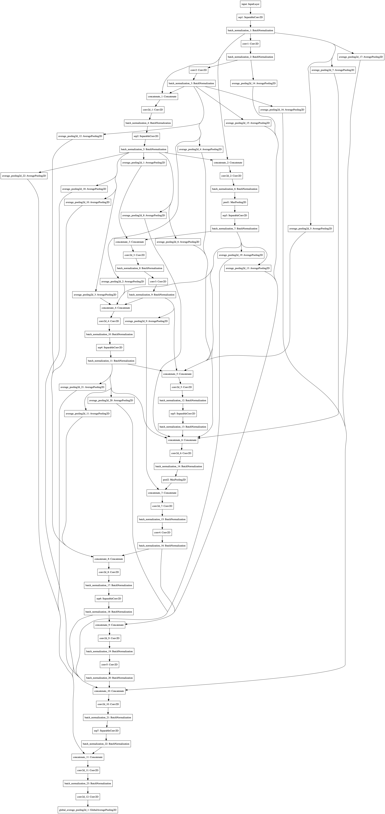

# enas-keras-cifar10
An implementation of the network proposed in ENAS paper for CIFAR-10 dataset.

Uses Cut Out image augmentation.
Final model has 1.3M parameters, achieves 91.2% validaiton accuracy, 83 epochs.

